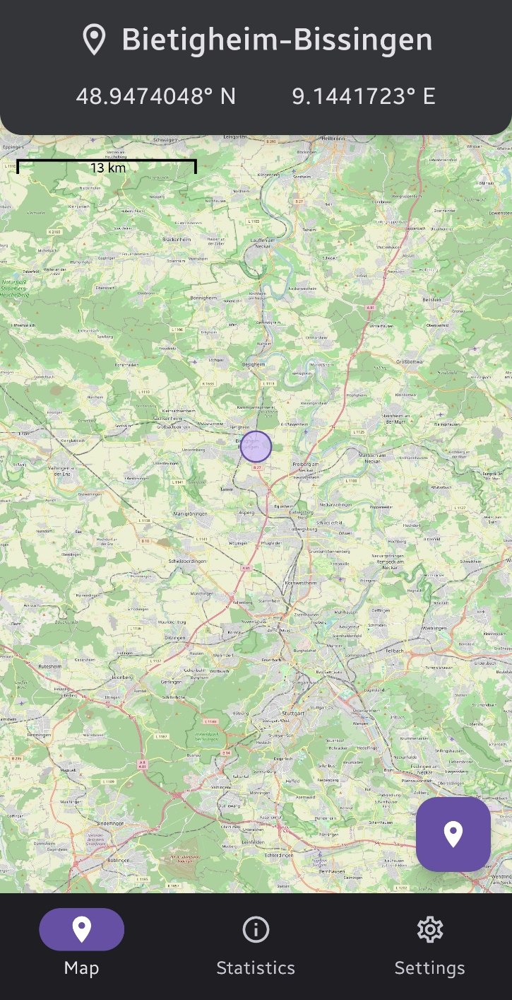
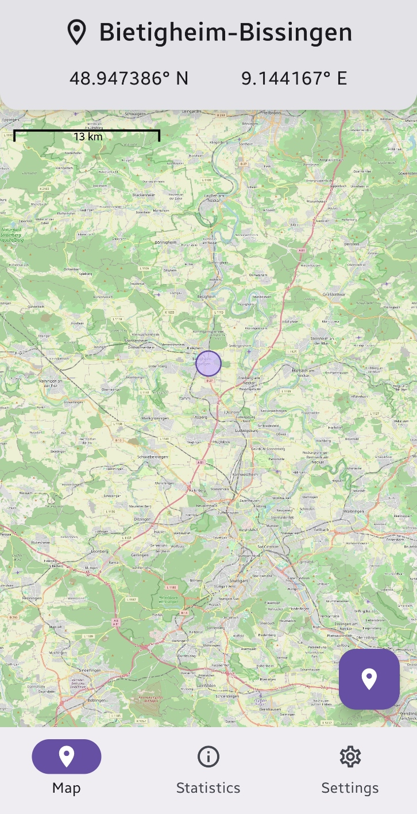
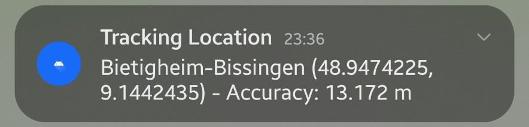
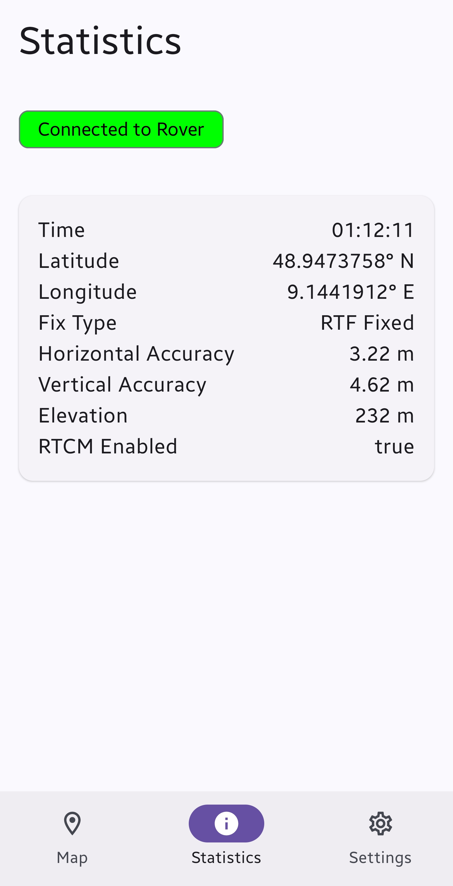
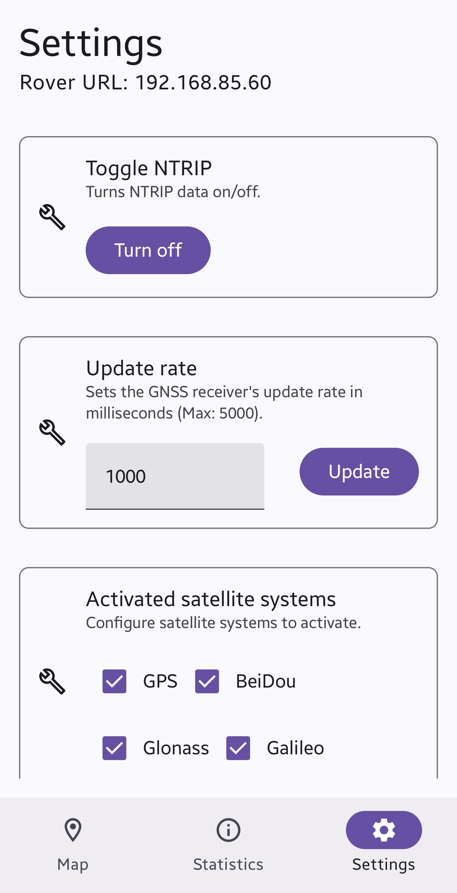
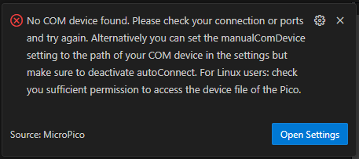

# GNSS Tracking App

## Description

This project presents a working GNSS tracking app for my Bachelor Thesis at
Heilbronn University of Applied Sciences (HHN). Designed for Android 10+ and leveraging
OpenStreetMap tools for Android, the app offers an intuitive interface for tracking GNSS data and
visualizing locations on a map in real-time. It also provides real-time location notifications and
detailed statistical insights.

The app is built with the latest version of Kotlin and utilizes the K2 compiler, which enhances
compile speed.

The microcontroller which is used in this project is the Raspberry Pi Pico W RP2040, 
the GNSS module is the Sparkfun u-blox ZED-F9P.

## Used Libraries

- [osmdroid - OpenStreetMap-Tools for Android](https://github.com/osmdroid/osmdroid)
- [Jetpack Compose with Material 3](https://developer.android.com/compose)
- [Ktor for creating HTTP requests and websocket connections](https://ktor.io/)
- [Koin - Kotlin & Kotlin Multiplatform Dependency Injection framework](https://insert-koin.io/)
- [Gson - Converts Java Objects into JSON and back](https://github.com/google/gson)

## Screenshots

## Features

### Implemented

- Map Screen for Location Tracking
  - Displays your location as a circle on the map, with accuracy support
  - Scale overlay
  - Pinch-to-zoom functionality for map navigation
  - Use the Geocoder API as a fallback to find your location by tapping the
    button at the bottom right
- Real-Time location notifications
- WebSocket connection support to interface with a GNSS module
- Statistics Screen to visualize GNSS data
- Settings Screen for customization options

## Installation

Just install the `app-release.apk` in [release_v2_20250427](apk/release_v2_20250427) on your Android 
device.

Hint: Installing the `app-release.apk` in [release_v1_20250123](apk/release_v1_20250123) will not 
work in an intended way because the websocket IP is hardcoded -> the code to this time was built 
with Android Studio only and was not exported as apk so the IP could be changed in the code 
directly. If you still want to try it out, you can check out the code in this commit:
https://github.com/JustLime/gnss-tracking-app/tree/59d81a0cb17ee5d0139a936a488a7834f0c556ab

Open the project folder in Android Studio and in 
[BaseApplication.kt](app/src/main/java/de/hhn/gnsstrackingapp/BaseApplication.kt) change the IP
address in the `baseUrl` variable to the IP address of your microcontroller. Afterwards, run the app
on your physical Android smartphone using Android Studio. Make sure that USB debugging is enabled.

### Prerequisites

- [Android Studio](https://developer.android.com/studio)
- [Visual Studio Code](https://code.visualstudio.com/)
- [MicroPico](https://marketplace.visualstudio.com/items?itemName=paulober.pico-w-go)

### Installing MicroPico

1. Install the extension in your Visual Studio Code profile
2. 
If this error appears after the installation of the extension, make sure to assign the
COM port of your connected microcontroller manually 
   - go into the Command Palette menu by pressing Ctrl+Shift+P -> 
   Preferences: Open User Settings (JSON) / Preferences: Open Workspace Settings (JSON)
   - Add this line: `"micropico.manualComDevice": "COM7"` (change the COM port number if it differs)
3. Open the project folder (File -> Open Folder...) and select the folder with the microcontroller 
project
4. If it is a fresh project, right click on the file explorer on the left side in Visual Studio Code 
and choose "Initialize MicroPico Project" - a new `.micropico` file should have been created

### Configuration

#### Rover Firmware

The source code for the firmware can be found in 
[de.hhn.gnss_rtk_rover](./lib/de.hhn.gnss_rtk_rover).

1. Open the project folder using Visual Studio Code
2. Connect your microcontroller to the PC so it can be found by MicroPico
3. Change the global settings like WiFi credentials of your mobile hotspot and NTRIP credentials in 
[globals.py](./lib/de.hhn.gnss_rtk_rover/utils/globals.py)
   - `WIFI_SSID`: SSID/Name of the mobile hotspot network
   - `WIFI_PW`: Password of the mobile hotspot network
   - `WIFI_CHECK_TIME`: Interval in seconds where it checks if the WiFi connection is established
   - `NTRIP_USER`: Username for the authentication to the NTRIP server
   - `NTRIP_PW`: Password for the authentication to the NTRIP server
   - `NTRIP_SERVER`: IP address of the NTRIP server
   - `MOUNTPOINT`: Mountpoint of the NTRIP server you want to use
4. Build and flash the firmware to the microcontroller by pressing right click on the file explorer 
on the left side in Visual Studio Code and choose "Upload project to Pico"

#### Websocket Connection

1. Create a mobile hotspot on your Android smartphone
   - Go to Settings -> Connections -> Mobile Hotspot and Tethering
   - Press on "Mobile Hotspot"
   - Change your "Network name" and "Password" to your liking, do NOT forget to change the 
   - credentials in [globals.py](./lib/de.hhn.gnss_rtk_rover/utils/globals.py) as well afterwards!
   - Change the Band to "2.4 GHz" as 5 GHz can make issues (e.g. not finding the device) 
   - Turn on "Mobile Hotspot"
2. Connect the microcontroller with the GNSS module via mobile hotspot of your
smartphone
   - The microcontroller should be put on AFTER the mobile hotspot network is created
   - If the green LED of the microcontroller stops blinking and flashes permanently the connection
   to the mobile hotspot is established
3. Retrieve the microcontroller's IP address
   - In the mobile hotspot menu, you can see all the connected devices
   - Press on the connected microcontroller, you can now see the IP address of the device
4. Open the app
5. Go to the Settings screen
6. Enter the valid IP address of the microcontroller in the text field under "WebSocket IP"
7. Press "Update"
   - It now tries to establish a WebSocket connection to the microcontroller

## Usage

### Launching the App

After opening the app "GNSSTrackingApp" on your Android smartphone you are now redirected to the 
Map Screen which is also the Home Screen.

### Map Screen

The map screen allows you to track your location in real-time and visualize it on the map. If you 
are connected to the microcontroller the location data of the GNSS module will be used, otherwise 
the Geocoder API will be used to find your location.

The button at the bottom right allows you to find your own location by tapping it. After tapping a 
zooming and panning animation will be played so you can see in real-time where you are. You can also
zoom in and out by pinching with your fingers.

Also, there is a scale overlay which shows the scale of the map.

### Statistics Screen

The statistics screen shows the GNSS data which is collected by the microcontroller in real-time. 
It shows if the microcontroller (Rover) is connected and if so, it displays the current time, 
latitude, longitude, the fix type, the horizontal and vertical accuracy and the elevation. 
Additionally, it displays if the RTCM/NTRIP is enabled or not.

### Settings Screen

The settings screen allows you to customize the app in different ways. You can change the Websocket 
IP address, toggle on or off the NTRIP data, change the update rate and activate the single 
satellite systems. For each setting an HTTP request will be sent to the microcontroller.

## Known Issues

- [ ] No unit testing story
- [ ] Allowed insecure WebSocket connection in [network_security_config.xml](app/src/main/res/xml/network_security_config.xml), as required by 
Android's security policy
- [ ] City name will only be displayed for Geocoder API, not for GNSS module, same for the 
notification
- [ ] HTTP requests are not cached and could be displayed in a bit clunky manner
